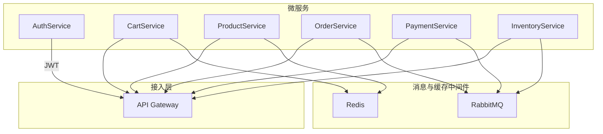

# 📌分布式电商平台系统架构文档

## 1. 系统架构总览
### 1.1 架构图示意（演进示意图）

> 单体架构 → DDD 分层 → 微服务架构 + 接入层 + 中间件集成

```less
                 +-------------------+
                 |   API Gateway     |
                 +-------------------+
                          |
     +--------------------+--------------------+
     |         |           |           |        |
  [Cart]   [Order]     [Product]   [Payment]  [Inventory]
     |         |           |           |        |
     |         +-----------+-----------+--------+
     |                     |
     |               [RabbitMQ]
     |
  [Redis]  ←-- Cart 快取     [SQLServer] ← 各服务独库
```

### 1.2 三层架构 + DDD 模块拆分

- **表示层（Web API）**：对接 API Gateway，承载 RESTful 接口。
- **应用层（Application）**：处理业务应用流程、服务编排。
- **领域层（Domain）**：实体、聚合根、领域服务、值对象等建模。
- **基础设施层（Infrastructure）**：数据库访问、缓存、消息等技术实现。
- **支撑层（Common Services）**：日志、配置、服务发现、认证网关等共通能力。

## 2. 微服务拆分方案

### 2.1 拆分优先级与技术选型

| 微服务           | 拆分优先级 | 技术选型                                  | 通信方式       | 数据持久化         | 优化建议                           |
| ---------------- | ---------- | ----------------------------------------- | -------------- | ------------------ | ---------------------------------- |
| CartService      | ⭐⭐⭐⭐       | ASP.NET Core Web API + Redis              | REST           | Redis 内存缓存     | 轻量服务，可快速拆分，无状态化部署 |
| ProductService   | ⭐⭐⭐⭐       | ASP.NET Core Web API + EF Core + Redis    | REST           | SQL Server + Redis | 图片使用 OSS/CDN 托管              |
| AuthService      | ⭐⭐⭐        | IdentityServer4 + JWT + OAuth2            | REST           | SQL Server         | 拆分权限模型、支持社交登录扩展     |
| OrderService     | ⭐⭐⭐⭐       | ASP.NET Core Web API + RabbitMQ + EF Core | REST + MQ      | SQL Server         | 使用 Saga/Outbox 模式保持一致性    |
| PaymentService   | ⭐⭐⭐        | Web API + 第三方支付 SDK（支付宝、微信）  | REST + WebHook | SQL Server         | 引入定时任务/队列做账务核对        |
| InventoryService | ⭐⭐⭐        | ASP.NET Core Web API + EF Core            | REST + MQ      | SQL Server         | 支持锁库存 + 补偿逻辑 + 秒杀优化   |

### 2.2 推荐拆分顺序与原因

1. ✅ **CartService（购物车服务）**：无需数据库，易部署，压力大，应优先拆。
2. ✅ **ProductService（商品服务）**：缓存设计完善，聚合结构清晰。
3. ✅ **AuthService（用户服务）**：核心网关依赖，应尽早解耦并实现单点登录。
4. ✅ **OrderService（订单服务）**：复杂但重要，事件驱动拆分可带来显著收益。
5. ✅ **PaymentService / InventoryService**：拆分需等交易链条搭建后逐步引入。

## 3. 系统模块职责划分

| 模块名称         | 职责范围                                     | 主要组件或子模块                                            |
| ---------------- | -------------------------------------------- | ----------------------------------------------------------- |
| 用户认证模块     | 用户注册登录、身份认证与权限管理             | `AccountService`、`JWT`、`IdentityServer4`、`RBAC` 模型     |
| 商品中心模块     | 商品信息、分类、SKU、图片托管                | `ProductService`、`CategoryService`、`SkuService`、OSS 支持 |
| 购物车／订单模块 | 用户购物流程、订单生命周期管理、活动策略等   | `CartService`、`OrderService`、`PromotionService`           |
| 支付模块         | 发起支付、回调处理、退款、账务核对           | `PaymentGateway`、`PaymentCallbackHandler`                  |
| 库存模块         | 实时库存管理、锁定与释放、预警               | `InventoryLockService`、`InventorySyncService`              |
| 后台管理模块     | 商品、订单、用户、活动等统一管理后台         | `AdminService`、`DashboardService`、统计分析                |
| 支撑模块         | 公共基础能力：缓存、日志、配置中心、消息队列 | `Redis`、`Serilog`、`Apollo/Consul`、`RabbitMQ`             |

## 4. 架构可视化图（UML）



## ✅ 5. 中间件与基础设施配置

| 类型     | 工具 / 技术     | 职责                         |
| -------- | --------------- | ---------------------------- |
| 日志     | Serilog + ELK   | 统一日志采集、结构化日志输出 |
| 缓存     | Redis           | 商品缓存、购物车存储         |
| 消息队列 | RabbitMQ        | 异步解耦，处理订单/库存消息  |
| 配置中心 | Apollo / Consul | 动态配置管理与服务发现       |
| 网关     | YARP / Ocelot   | 请求转发、认证鉴权、限流     |
| ORM      | EF Core         | 数据库持久化操作             |
| 安全机制 | JWT / OAuth2    | Token 授权、SSO 单点登录     |
| 数据库   | SQL Server      | 各微服务独库                 |


------

## ✅ 6. 项目结构规划（建议）

```bash
ecommerce-platform/
├── admin/                # 后台管理界面
├── gateway/              # API 网关
├── services/
│   ├── identity/         # 用户服务
│   ├── product/          # 商品服务
│   ├── cart/             # 购物车服务
│   ├── order/            # 订单服务
│   ├── payment/          # 支付服务
│   ├── inventory/        # 库存服务
├── infrastructure/       # 基础设施，如数据库、缓存、消息
├── common/               # 通用模块，如日志、配置、认证封装
├── deployment/           # Docker/K8s 部署配置
```
