```mermaid
graph TD
  subgraph UserContext
    UserService[UserService]
  end

  subgraph ProductContext
    ProductService[ProductService]
  end

  subgraph CartContext
    CartService[CartService]
  end

  subgraph OrderContext
    OrderService[OrderService]
  end

  subgraph PaymentContext
    PaymentService[PaymentService]
  end

  subgraph InventoryContext
    InventoryService[InventoryService]
  end

  %% 上游ä¾èµ–
  UserService --> CartService
  ProductService --> CartService
  ProductService --> InventoryService
  ProductService --> ReviewAggregate
  CartService --> OrderService
  OrderService --> PaymentService
  PaymentService --> InventoryService
```

# 🧩 分布式电商系统领域模型文档

## 一、领域模型设计（DDD聚合划分）

系统基于领域驱动设计（DDD）原则，将业务划分为若干聚合（Aggregate），每个聚合包含聚合根及其子实体和值对象，聚合之间通过上下文边界实现解耦，为微服务架构提供基础。

### 🧍 用户聚合（User Aggregate）

| 实体名           | 说明                               |
| ---------------- | ---------------------------------- |
| **User**         | 用户基本信息、登录凭据等           |
| **Role**         | 用户角色（买家、卖家、管理员）     |
| **UserProfile**  | 扩展资料（昵称、头像、注册时间等） |
| **UserLoginLog** | 登录历史记录，安全审计用途         |
| **UserAddress**  | 收货地址管理，支持多个地址         |

✅ 关系说明：

- 一个用户可拥有多个角色（多对多）
- 一个用户可拥有多个地址（UserAddress）（一对多）

------

### 🛒 购物车聚合（Cart Aggregate）

| 实体名       | 说明                             |
| ------------ | -------------------------------- |
| **Cart**     | 每个用户唯一的购物车             |
| **CartItem** | 加入的商品 SKU、数量、选中状态等 |

✅ 关系说明：

- 每个用户拥有一个购物车（一对一）
- 一个购物车可包含多个购物车项（CartItem）（一对多）
- 每个 CartItem 关联一个 SKU（多对一）

------

### 📦 商品聚合（Product Aggregate）

| 实体名               | 说明                                 |
| -------------------- | ------------------------------------ |
| **Product**          | 商品主信息（如“iPhone 15”）          |
| **SKU**              | 销售规格（如“黑色 128G”）            |
| **Category**         | 多级分类结构                         |
| **Brand**            | 品牌信息（Apple、小米等）            |
| **ProductImage**     | 轮播图、主图、详情图等               |
| **ProductAttribute** | 商品自定义属性（如屏幕尺寸、重量等） |

✅ 关系说明：

- 一个商品属于一个分类（多对一）
- 一个商品可有多个 SKU（一对多）
- SKU 与库存聚合联动

------

### 📑 订单聚合（Order Aggregate）

| 实体名          | 说明                               |
| --------------- | ---------------------------------- |
| **Order**       | 主订单记录                         |
| **OrderItem**   | 商品项记录                         |
| **OrderStatus** | 状态值（已创建、已支付、已发货等） |
| **OrderLog**    | 操作记录，如“支付成功”、“发货”等   |

✅ 关系说明：

- 一个订单包含多个订单项（OrderItem）（一对多）
- 一个订单由一个用户创建（多对一）
- 一个订单对应一个收货地址（多对一）
- 一个订单拥有多个状态变更记录（OrderLog）（一对多）

------

### 💰 支付聚合（Payment Aggregate）

| 实体名             | 说明                                   |
| ------------------ | -------------------------------------- |
| **Payment**        | 支付详情：金额、支付时间、关联订单     |
| **PaymentStatus**  | 支付状态：成功、失败、待支付、已退款等 |
| **RefundRecord**   | 售后退款记录                           |
| **PaymentChannel** | 支付方式（如支付宝、微信、银行卡）     |

✅ 关系说明：

- 一笔支付记录对应一个订单（多对一）
- 每笔支付具备一个状态（多对一）

------

### 🏭 库存聚合（Inventory Aggregate）

| 实体名           | 说明                             |
| ---------------- | -------------------------------- |
| **Inventory**    | 每个 SKU 对应一条库存记录        |
| **InventoryLog** | 库存变动日志，如下单、发货等操作 |

✅ 关系说明：

- 每个 SKU 对应一个库存（Inventory）（一对一）
- 一条库存记录可关联多个变动日志（InventoryLog）（一对多）

------

### 📦 物流聚合（Shipping Aggregate）

| 实体名              | 说明                       |
| ------------------- | -------------------------- |
| **Shipment**        | 发货记录，对应订单         |
| **TrackingInfo**    | 快递单号、物流状态、轨迹   |
| **ShippingCompany** | 物流服务商，如顺丰、圆通等 |

------

### 🌟 评价聚合（Review Aggregate）

| 实体名          | 说明                             |
| --------------- | -------------------------------- |
| **Review**      | 用户对商品的评价                 |
| **ReviewReply** | 卖家或客服的评论回复             |
| **Rating**      | 多维评分（商品质量、物流服务等） |

------

### 🎁 优惠券聚合（Coupon Aggregate）

| 实体名         | 说明                              |
| -------------- | --------------------------------- |
| **Coupon**     | 优惠券定义，如满减、打折等        |
| **CouponUser** | 用户领取与使用记录                |
| **CouponRule** | 使用规则，如满100可用、限新用户等 |

------

### 🔔 消息通知聚合（Notification Aggregate）

| 实体名               | 说明                             |
| -------------------- | -------------------------------- |
| **Notification**     | 系统推送消息                     |
| **UserNotification** | 用户收到的消息记录（是否已读等） |

------

### 🧠 聚合模型全景总览表

| 聚合名称 | 聚合根         | 子实体/值对象                          | 说明                     |
| -------- | -------------- | -------------------------------------- | ------------------------ |
| 用户     | `User`         | Role、Profile、LoginLog、UserAddress   | 用户体系与权限控制       |
| 商品     | `Product`      | SKU、Category、Brand、Attribute、Image | 商品主信息 + 多规格 SKU  |
| 购物车   | `Cart`         | CartItem                               | 用户临时下单容器         |
| 订单     | `Order`        | OrderItem、Address、OrderLog、Status   | 订单生命周期全过程       |
| 支付     | `Payment`      | PaymentStatus、Refund、Channel         | 支付记录与售后退款       |
| 库存     | `Inventory`    | InventoryLog                           | SKU 库存管理与操作日志   |
| 物流     | `Shipment`     | TrackingInfo、ShippingCompany          | 发货与物流跟踪           |
| 评价     | `Review`       | Reply、Rating                          | 商品口碑与用户反馈       |
| 优惠券   | `Coupon`       | CouponUser、CouponRule                 | 营销工具体系             |
| 通知     | `Notification` | UserNotification                       | 订单状态推送、平台消息等 |

------

## 二、上下文边界划分（Bounded Context & Context Mapping）

| 微服务名称（上下文） | 聚合（Aggregate）                                            | 简要职责说明                                                 |
| -------------------- | ------------------------------------------------------------ | ------------------------------------------------------------ |
| **UserService**      | UserAggregate、RoleAggregate、AddressAggregate               | 用户注册登录、权限分配、地址管理、通知订阅等用户相关功能统一建模管理 |
| **ProductService**   | ProductAggregate、SkuAggregate、CategoryAggregate、BrandAggregate、ReviewAggregate | 商品展示、SKU 库存属性、分类与品牌维护、用户评价处理         |
| **CartService**      | CartAggregate、CouponAggregate                               | 用户购物车、购物项管理，优惠券使用策略控制                   |
| **OrderService**     | OrderAggregate、OrderItemAggregate、ShipmentAggregate        | 创建订单、订单状态管理、物流信息聚合与跟踪                   |
| **PaymentService**   | PaymentAggregate、RefundAggregate、ChannelAggregate          | 支付发起、退款逻辑、支付渠道配置管理                         |
| **InventoryService** | StockAggregate、StockLogAggregate                            | SKU库存、预扣减、回滚补偿策略                                |

------

## 三、上下文依赖关系图谱

| 上下文名称           | 上游依赖                                     | 下游依赖                                       | 描述                                 |
| -------------------- | -------------------------------------------- | ---------------------------------------------- | ------------------------------------ |
| **UserService**      | -                                            | CartService（用户校验）                        | 提供用户身份和权限能力               |
| **ProductService**   | -                                            | CartService、InventoryService、ReviewAggregate | 提供商品、SKU、品牌、分类数据        |
| **CartService**      | UserService、ProductService、CouponAggregate | OrderService                                   | 聚合下单前的数据、验证优惠信息       |
| **OrderService**     | CartService                                  | PaymentService、InventoryService               | 创建订单后触发支付与库存逻辑         |
| **PaymentService**   | OrderService                                 | InventoryService、NotificationModule           | 成功支付后扣减库存，触发消息通知     |
| **InventoryService** | ProductService、PaymentService               | -                                              | 库存数据管理，处理支付后扣减库存逻辑 |

> 📌 补充说明：Coupon、Review、Notification 等是扩展性强的聚合模块，初期作为聚合存在于主服务中，未来可独立拆分成服务。

------

## 四、上下文边界映射关系图

