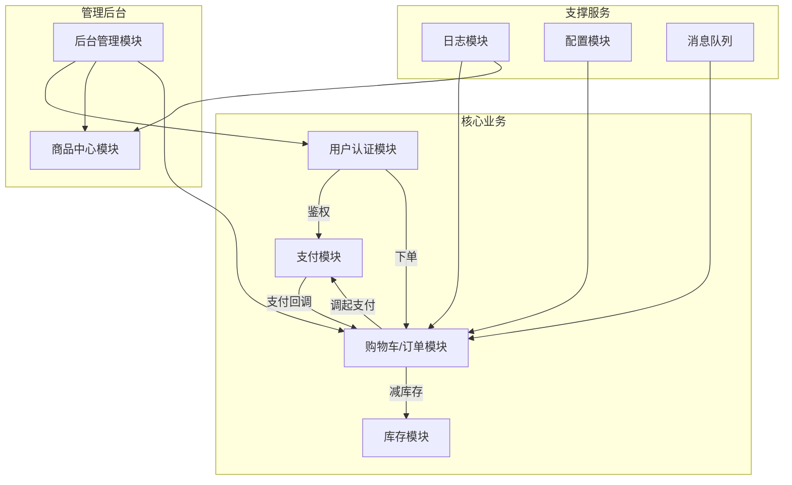

# 📌 项目名称：《分布式电商平台》（E-Commerce Platform）

## 1. 系统架构总览
### 1.1 单体架构向微服务演进图（按 DDD 模块拆分）

> 说明：展示从单体结构逐步拆分为微服务的全过程，基于 DDD 三层结构（应用层、领域层、基础设施层）进行模块划分，每个服务具备独立部署能力。

```
┌─────────────────────────────────────────────────────────────────────┐
│                      单体应用 API 层（ASP.NET Core）                  │
├─────────────────────────────────────────────────────────────────────┤
│                    应用服务层（Application）                           │
│ ┌──────────────┐  商品服务（ProductAppService）             🔜 ProductService（REST）│
│ │ 已支持拆分   │  - API：/api/products                                 │
│ │ 支持独立部署 │  - 聚合根：ProductAggregate                            │
│ └──────────────┘  - 缓存策略：Redis                                   │
│                                                                     │
│ ┌──────────────┐  用户服务（UserAppService）               🔜 AuthService/UserService（REST）│
│ │ 已支持拆分   │  - 认证机制：JWT + OAuth                               │
│ │ 支持独立部署 │  - 可接入 IdentityServer4                              │
│ └──────────────┘                                                    │
│                                                                     │
│ ┌──────────────┐  订单服务（OrderAppService）             🔜 OrderService（REST + 消息）│
│ │ 拆分优先级高 │  - 聚合：订单、订单项、状态机                             │
│ │ 可事件驱动化 │  - 支持 Saga 模式与 Outbox 模式                         │
│ └──────────────┘                                                    │
│                                                                     │
│ ┌──────────────┐  购物车服务（CartAppService）           🔜 CartService（Redis + REST）│
│ │ 已支持拆分   │  - Redis结构：cart:{userId}                           │
│ │ 轻量级无持久化 │ - 高并发下通过网关转发支持扩展性                         │
│ └──────────────┘                                                    │
├─────────────────────────────────────────────────────────────────────┤
│                   领域模型层（Domain）                                 │
│ - ProductAggregate（对应商品服务）                                     │
│ - UserAggregate（对应用户服务）                                        │
│ - OrderAggregate（对应订单服务）                                       │
│ - 值对象（地址、价格、库存等）建议抽离为共享内核模块 SharedKernel             │
│ - 支持领域事件（Domain Events）：基于 Mediator 或消息队列实现              │
├─────────────────────────────────────────────────────────────────────┤
│                  基础设施层（Infrastructure）                          │
│ - Repository（EF Core 实现） → 各服务独立持久化                          │
│ - Redis 缓存 → 商品/购物车缓存                                          │
│ - 日志组件（Serilog） → 支持集中日志平台接入（如 ELK）                     │
├─────────────────────────────────────────────────────────────────────┤
│                   公共服务模块（Common）                               │
│ - 日志服务（Serilog + ELK）                                           │
│ - 缓存服务（Redis 集群）                                               │
│ - 配置中心（基于 .NET 抽象层封装 Apollo / Consul）                       │
│ - 网关服务（推荐 YARP / Ocelot 实现）                                   │
└─────────────────────────────────────────────────────────────────────┘

```

------

## 2. 微服务拆分方案

### 2.1 拆分建议汇总

| 模块       | 拆分优先级 | 单体内位置        | 通信方式     | 推荐技术方案                                       | 衍生优化建议                        |
| ---------- | ---------- | ----------------- | ------------ | -------------------------------------------------- | ----------------------------------- |
| 商品服务   | 高         | ProductAppService | REST + Redis | 独立数据库、缓存机制、限流控制                     | 支持灰度发布、使用 CDN 进行图片托管 |
| 用户服务   | 中         | UserAppService    | REST + JWT   | IdentityServer4 / OAuth2、统一认证授权、JWT机制    | 可扩展 RBAC 权限模型                |
| 订单服务   | 高         | OrderAppService   | REST + MQ    | Saga 模式、Outbox 模式、状态机建模、事件驱动一致性 | 引入 RabbitMQ 及补偿机制            |
| 购物车服务 | 中         | CartAppService    | Redis + REST | 纯内存式 Redis 模型，无数据库                      | 设置 TTL 及 Session 限制防雪崩      |
| 公共服务   | 基础       | 各模块通用组件    | 内部共享     | Serilog、配置中心、服务发现（Consul）              | 推荐统一部署以便统一管理            |

------

### 2.2 拆分推荐顺序及依据

1. **购物车服务**：服务轻量，无数据库依赖，拆分成本低。
2. **商品服务**：聚合结构清晰，缓存方案明确，易于独立部署。
3. **用户服务**：需统一处理认证逻辑，可结合权限系统分步抽离。
4. **订单服务**：核心交易逻辑集中，复杂度高但独立后收益显著。
5. **公共服务模块**：日志、配置、缓存等服务需优先抽离以支持全局运行环境。

## 3. 模块划分说明

| 模块名称         | 职责范围                                           | 主要组件或子模块                                             |
| ---------------- | -------------------------------------------------- | ------------------------------------------------------------ |
| 用户认证模块     | 用户注册登录、身份认证与权限管理                   | AccountService、JWT 管理、IdentityServer4 集成               |
| 商品中心模块     | 商品信息、分类、SKU、图片存储与访问控制            | ProductService、CategoryService、SKUService、OSS 管理组件    |
| 购物车／订单模块 | 用户购物流程、订单生命周期管理、促销策略与活动处理 | CartService、OrderService、PromotionService、订单事件处理器  |
| 支付模块         | 支付请求发起、回调通知、退款处理与账务核对         | PaymentService、CallbackHandler、ReconciliationScheduler     |
| 库存模块         | 实时库存查询、锁定与释放、预警机制                 | InventoryService、库存锁定服务、库存日志记录组件             |
| 后台管理模块     | 运维管理平台：商品、订单、用户、统计报表           | AdminController、DashboardService、数据报表生成服务          |
| 通用支撑模块     | 系统通用能力支撑：日志、缓存、配置、消息、通知     | LoggingModule、CacheModule、ConfigModule、MqModule、Notification |
| 基础设施模块     | 持久化层与集成设施：数据库、缓存、消息队列         | DbContext（EF Core）、RedisClient、MqProducer / Consumer     |
| 接入与安全模块   | API 网关、限流策略、安全策略（如跨域）             | GatewayConfig、RateLimitMiddleware、CorsMiddleware           |

## 4. 架构可视化组件图（UML）

可使用 Mermaid、Draw.io 等工具绘制模块依赖图，以增强架构直观性。如下为 Mermaid 示例：


