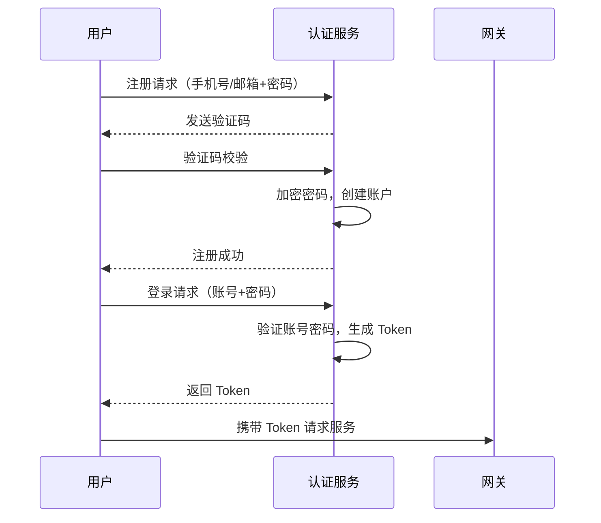
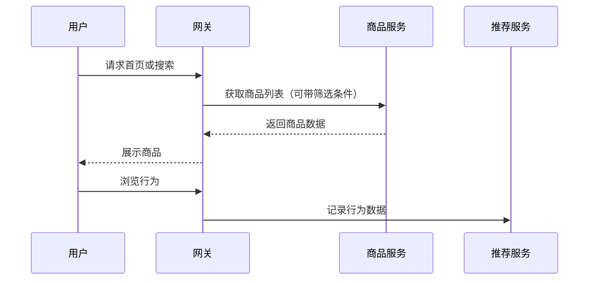
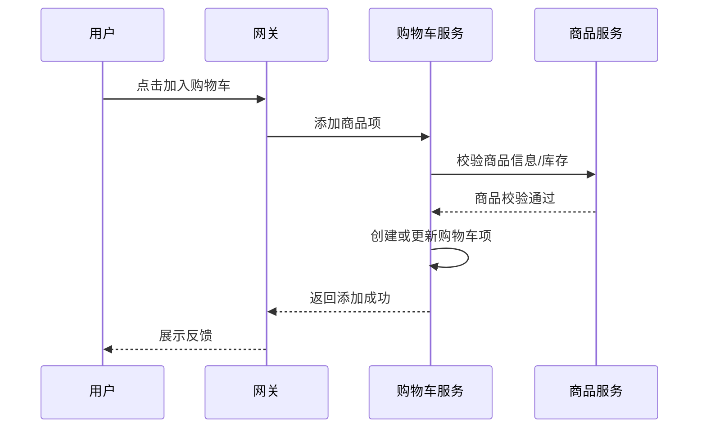
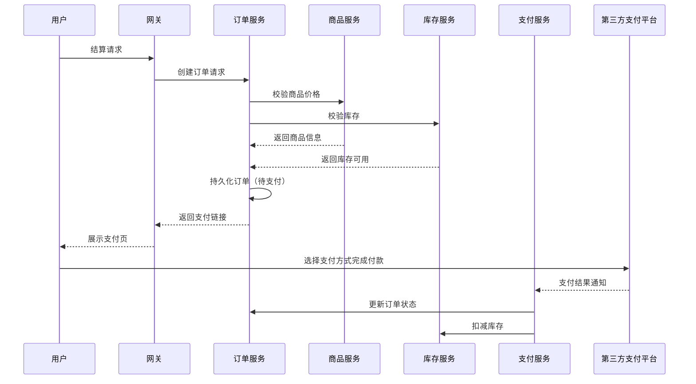
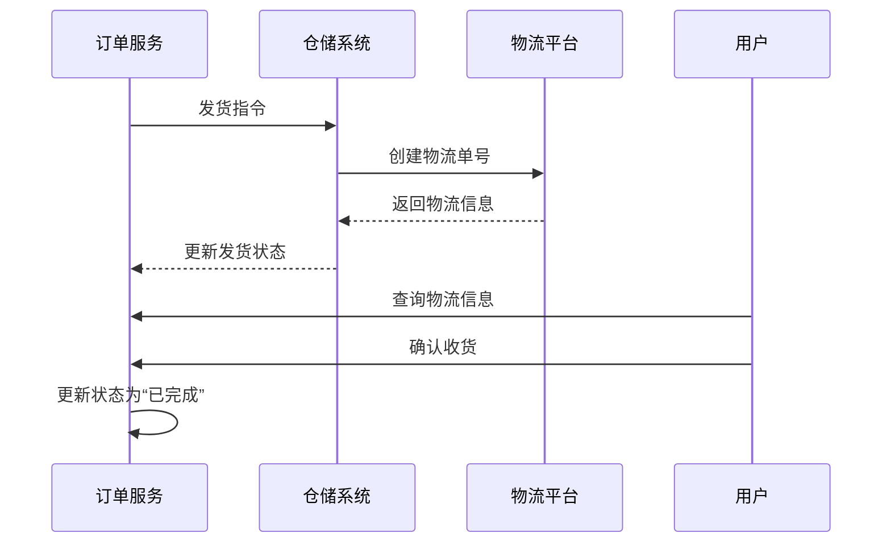
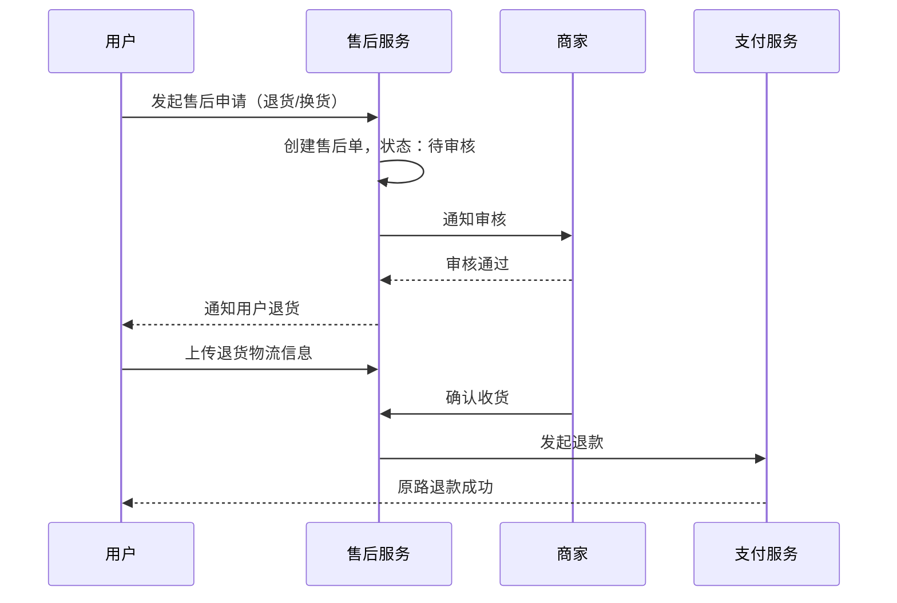

# 分布式电商系统核心业务流程说明文档

> **项目背景**：本系统为个人主导设计与实现的练习型分布式电商平台，采用 ASP.NET Core + Vue3 技术栈，遵循 DDD 架构与分层设计原则，逐步演进至微服务架构。本文档对核心业务流程进行标准建模，帮助开发人员清晰理解业务操作及系统交互行为。

## 一、业务流程建模总览

核心流程涵盖：

- 用户注册与登录
- 商品浏览与搜索
- 加入购物车与编辑
- 提交订单与支付
- 库存校验与扣减
- 订单发货与物流跟踪
- 售后申请与处理

每个流程均包含详细步骤、状态图与泳道图（以用户/系统为主），并指出后续可扩展方向。

------

## 二、用户注册与登录流程

### 流程步骤

1. 用户访问注册页面，填写手机号/邮箱、密码等信息。
2. 系统发送验证码至用户提供的联系方式。
3. 用户输入验证码，系统验证其有效性。
4. 系统对密码进行加密处理，创建用户账户。
5. 用户登录时，输入账号和密码。
6. 系统验证用户信息，生成 JWT 或 OAuth2 Token。
7. 用户成功登录，系统返回登录态信息。
8. 系统支持 Token 刷新、黑名单管理、踢出机制等功能。

### 流程泳道图

------

## **三、**商品浏览与搜索流程

### 流程步骤

1. 用户访问商城首页或分类页，触发商品展示。
2. 用户通过搜索栏输入关键词，系统返回相关商品。
3. 用户可以筛选（价格区间、品牌、销量等）或排序（综合、价格、好评等）。
4. 系统从商品服务拉取商品信息，支持分页展示与懒加载。
5. 系统记录用户浏览行为用于推荐与分析。

### 流程泳道图

------

## **四、**加入购物车流程

### 流程步骤

1. 用户点击“加入购物车”按钮，系统验证用户登录状态。
2. 系统将商品信息（商品ID、数量、价格快照）发送至购物车服务。
3. 若为首次添加，购物车服务创建购物车项；若已存在，则更新数量。
4. 系统返回添加成功反馈。
5. 用户可前往购物车页面查看、修改、删除商品项。

### 流程泳道图

------

## **五、创建订单与支付流程**

### 流程步骤

1. 用户点击“结算”，系统展示订单确认页。
2. 用户选择收货地址、发票、优惠券等信息后提交订单。
3. 系统调用商品与库存服务校验库存与价格，生成订单快照。
4. 系统生成订单并持久化，状态为“待支付”。
5. 系统跳转至支付网关，用户选择支付方式（支付宝、微信、余额）。
6. 第三方支付平台完成扣款，回调通知支付服务。
7. 支付服务更新订单状态为“已支付”，并通知库存锁定、发货等服务。

### 流程泳道图

------

## **六、发货与确认收货流程**

### 流程步骤

1. 支付完成后，系统触发仓储系统拣货发货。
2. 仓储系统更新物流信息，通知订单服务。
3. 用户在前台查看订单详情页可查看物流进度。
4. 用户收到货物后点击“确认收货”。
5. 系统更新订单状态为“已完成”。
6. 触发售后权限开放与评价入口。

### 流程泳道图

------

## **七、售后与评价流程**

### 流程步骤

1. 用户在订单完成后可发起评价或申请售后。
2. 用户选择售后类型（退货、换货、退款）并填写原因及上传凭证。
3. 系统生成售后申请记录，状态为“待审核”。
4. 售后服务审核通过后，系统通知用户并更新状态。
5. 若为退货退款，用户发起退货并上传物流信息。
6. 商家收到货物后确认并处理退款。
7. 系统原路退回用户资金，售后结束。

### 流程泳道图

