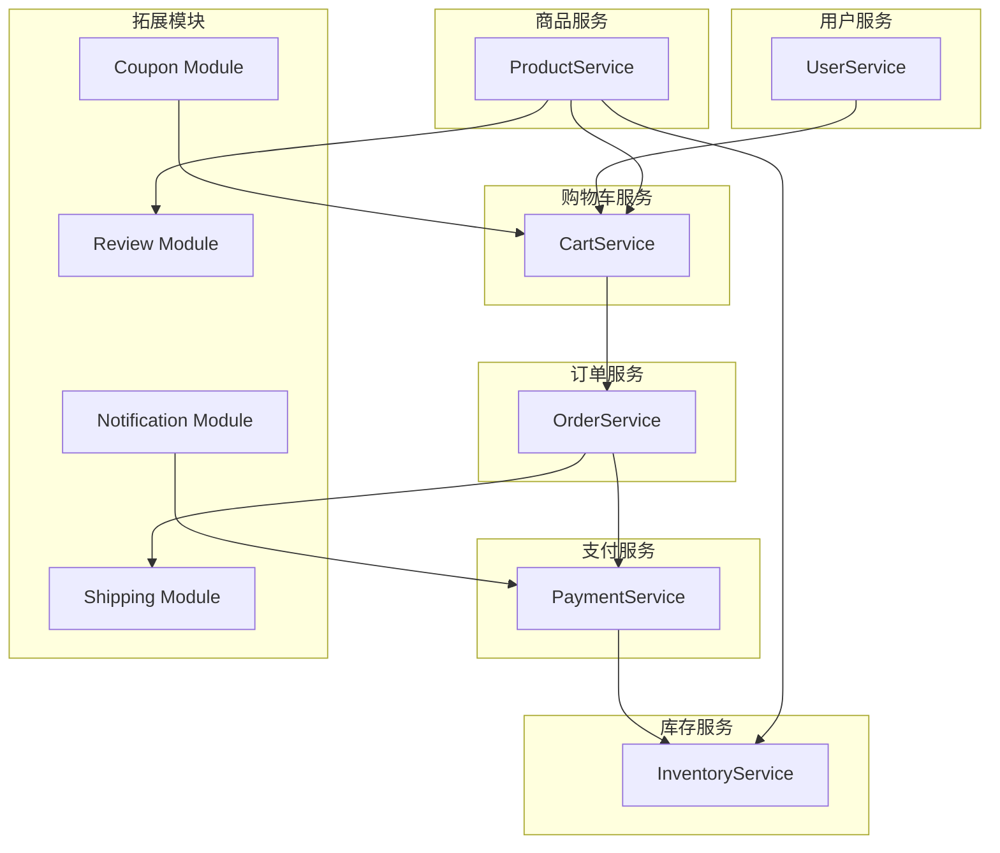

# 📘 分布式电商系统上下文边界与上下文映射文档（Bounded Context & Context Mapping）

本系统采用领域驱动设计（DDD）原则，结合微服务架构，将业务领域划分为若干个**上下文边界（Bounded Context）**，每个上下文边界对应一个独立的微服务模块，具备明确的业务职责和术语模型。

为提高系统的可维护性、扩展性与演进能力，各上下文之间通过明确定义的接口通信，避免模型污染和隐式依赖，部分上下游关系通过引入防腐层（Anti-Corruption Layer, ACL）实现解耦。

------

## 一、上下文边界

| 微服务名称           | 所属上下文边界（Bounded Context） | 主要包含聚合模块                                             | 上下文职责简述                                   |
| -------------------- | --------------------------------- | ------------------------------------------------------------ | ------------------------------------------------ |
| **UserService**      | 用户上下文                        | 用户（User）、角色（Role）、地址（UserAddress）、通知等      | 管理用户账户、登录权限、地址信息、安全审计等功能 |
| **ProductService**   | 商品上下文                        | 商品（Product）、SKU、分类（Category）、品牌（Brand）、评价（Review）等 | 提供商品展示、搜索、属性管理与评价等功能         |
| **CartService**      | 购物车上下文                      | 购物车（Cart）、购物项（CartItem）、优惠券（Coupon）等       | 负责用户加购流程、临时订单缓存及优惠券应用逻辑   |
| **OrderService**     | 订单上下文                        | 订单（Order）、订单项（OrderItem）、订单状态、订单日志、收货地址、物流（Shipping） | 管理订单生命周期、物流进度与用户确认交付         |
| **PaymentService**   | 支付上下文                        | 支付（Payment）、支付状态（PaymentStatus）、退款记录、支付渠道等 | 提供支付处理、退款管理与渠道接入的统一能力       |
| **InventoryService** | 库存上下文                        | 库存（Inventory）、库存日志（InventoryLog）等                | 跟踪 SKU 库存情况，支持库存扣减与补偿机制        |

------

## 二、上下文映射关系（Context Mapping）

在上下文边界之间存在一定的数据和业务依赖关系，为保持各服务间解耦，需明确定义其上下文映射模型（Context Mapping），包括数据流向、责任边界与依赖类型。以下为主要上下文之间的依赖映射说明：

| 上下文名称（服务/模块） |       所属聚合        |                 上游依赖                  |                  下游依赖                   |                             说明                             |
| :---------------------: | :-------------------: | :---------------------------------------: | :-----------------------------------------: | :----------------------------------------------------------: |
|     **UserService**     |   用户聚合（User）    |                     -                     |                 CartService                 | 负责用户注册、登录、认证与基础信息管理，供购物车服务进行用户身份与权限校验。 |
|   **ProductService**    |  商品聚合（Product）  |                     -                     | CartService、InventoryService、ReviewModule | 商品服务提供商品与 SKU 查询能力，是购物车、库存管理与用户评价等服务的重要数据提供方。 |
|     **CartService**     |  购物车聚合（Cart）   | UserService、ProductService、CouponModule |                OrderService                 | 管理用户购物车状态，依赖用户信息、商品信息及优惠券信息，向订单服务传递下单请求。 |
|    **OrderService**     |   订单聚合（Order）   |                CartService                |       PaymentService、ShippingModule        | 处理订单创建与管理，依赖购物车生成订单，联动支付服务处理交易，联动物流模块进行发货。 |
|   **PaymentService**    |  支付聚合（Payment）  |               OrderService                |    InventoryService、NotificationModule     | 支付服务处理订单支付事务，成功后通知库存服务扣减库存，通知模块发送支付结果。 |
|  **InventoryService**   | 库存聚合（Inventory） |      ProductService、PaymentService       |                      -                      | 管理 SKU 库存数据，受支付服务调用进行扣减，商品服务维护 SKU 映射关系。 |
|   **ShippingModule**    |   拓展模块（物流）    |               OrderService                |                      -                      | 非独立微服务，仅作为订单服务拓展模块，处理订单发货与物流跟踪逻辑。 |
|    **CouponModule**     |  拓展模块（优惠券）   |                     -                     |                 CartService                 |    提供优惠券查询与使用信息，供购物车计算订单金额时使用。    |
|    **ReviewModule**     |   拓展模块（评价）    |              ProductService               |                      -                      | 用户评价服务依赖商品信息，允许用户对商品进行评论，仅为拓展模块。 |
| **NotificationModule**  |   拓展模块（通知）    |                     -                     |               PaymentService                | 提供统一通知（如短信、站内信、推送）能力，由支付服务触发支付成功等场景下的消息发送。 |

> 注：部分模块如 **ReviewService（评价）**、**CouponService（优惠券）**、**NotificationService（通知）** 当前合并为核心服务中的子模块处理，未来系统扩展后可演进为独立微服务。

------

## 三、上下文边界分布图（Bounded Context Diagram）

以下为系统上下文的逻辑分布及主要依赖关系示意图：

> 可配合 C4 模型（Container / Component）进一步补充微服务之间接口细节、调用方式与安全策略。