# 核心业务流程建模文档

> 本文档基于 DDD（领域驱动设计）思想，结合聚合建模与微服务架构，梳理电商系统的 8 大核心业务流程，包括用户注册登录、商品上架浏览、购物车、订单、支付、库存、物流、评价与售后。

## 1. 用户注册与登录流程

### 1.1 流程步骤

1. 用户访问注册页面，填写手机号/邮箱、密码等信息。
2. 系统发送验证码至用户提供的联系方式。
3. 用户输入验证码，系统验证其有效性。
4. 系统对密码进行加密处理，创建用户账户。
5. 用户登录时，输入账号和密码。
6. 系统验证用户信息，生成 JWT 或 OAuth2 Token。
7. 用户成功登录，系统返回登录态信息。
8. 系统支持 Token 刷新、黑名单管理、踢出机制等功能。

### 1.2 业务流程图（泳道图）

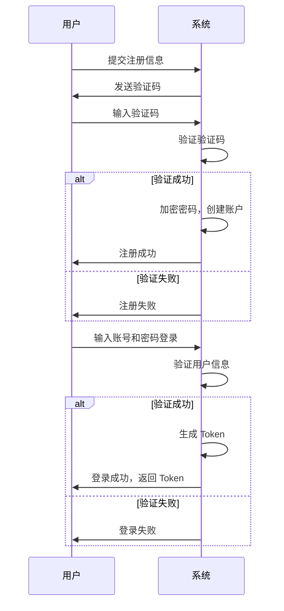

### 1.3 用例图

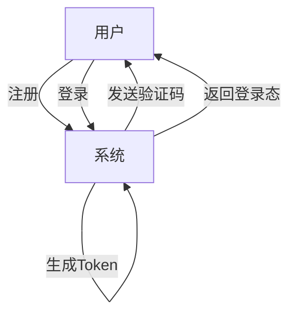

## 2. **商品上架与浏览流程**

### 2.1 流程步骤

1. 商家登录后台管理系统。
2. 商家填写商品信息，包括 SPU(标准产品单元)/SKU(最小库存单元)、类目、品牌、价格、库存等。
3. 系统对商品信息进行校验，保存至数据库。
4. 用户访问前台页面，浏览商品列表。
5. 用户可通过分页、类目过滤、关键词搜索等方式查找商品。
6. 用户点击商品，查看商品详情，包括库存、价格、图片、规格等。

### 2.2 业务流程图（泳道图）

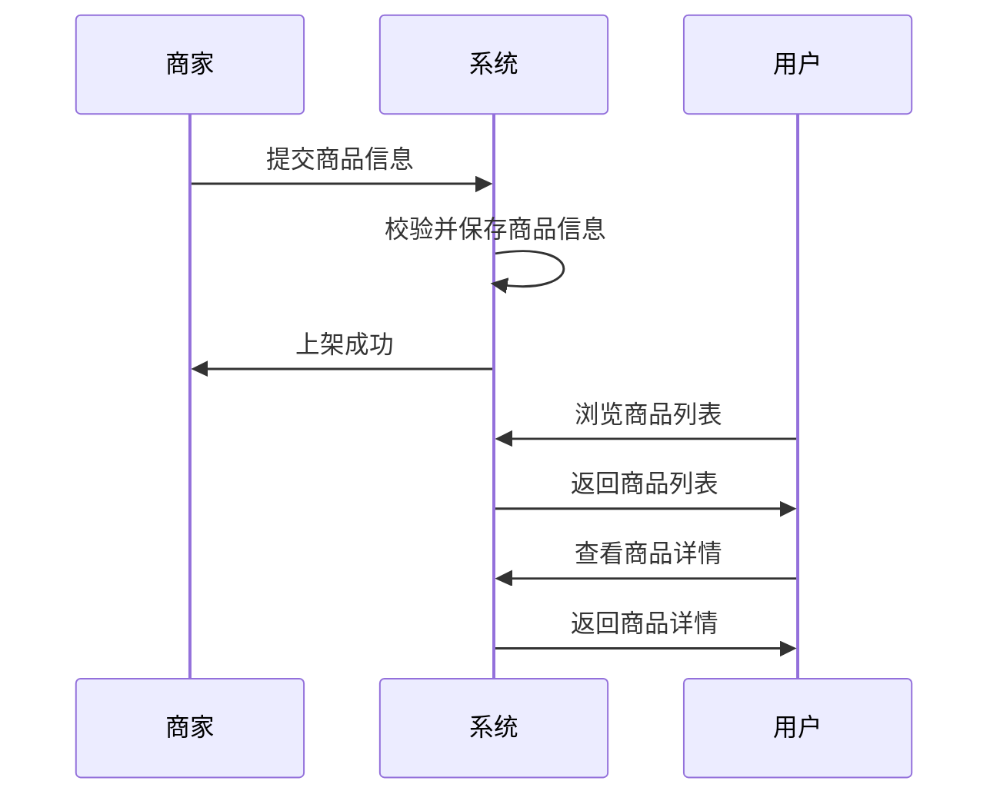

### 2.3 用例图

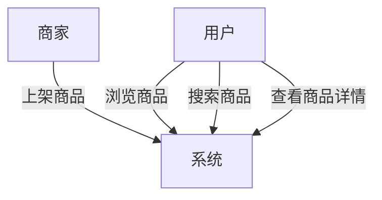

## 3. **购物车流程**

### 3.1 流程步骤

1. 用户在商品详情页点击“加入购物车”。
2. 系统将商品 SKU 和数量添加至用户的购物车中。
3. 用户访问购物车页面，查看已添加的商品列表。
4. 用户可修改商品数量或删除购物车项。
5. 系统实时更新购物车信息。

### 3.2 业务流程图（泳道图）

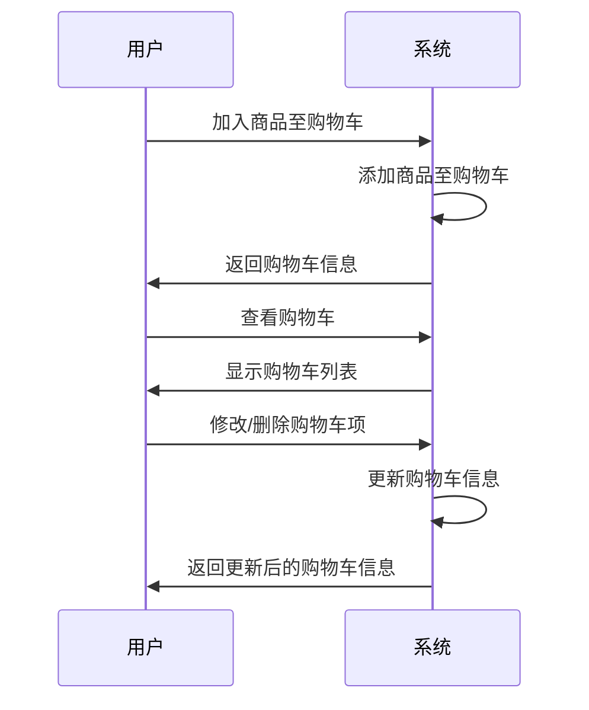

### 3.3 用例图

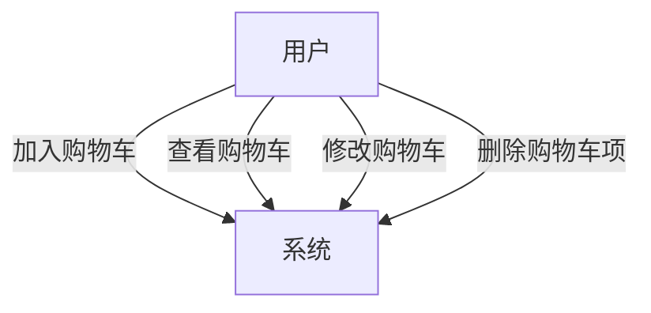

## 4. **订单创建与管理流程**

### 4.1 流程步骤

1. 用户在购物车页面选择商品，点击“提交订单”。
2. 系统校验商品库存，预占库存。
3. 系统生成订单，状态为“待支付”。
4. 用户支付订单，系统更新订单状态为“已支付”。
5. 商家发货，系统更新订单状态为“待收货”。
6. 用户确认收货，系统更新订单状态为“已完成”。
7. 若用户未支付，系统在设定时间后自动取消订单，释放库存。

### 4.2 业务流程图（泳道图）

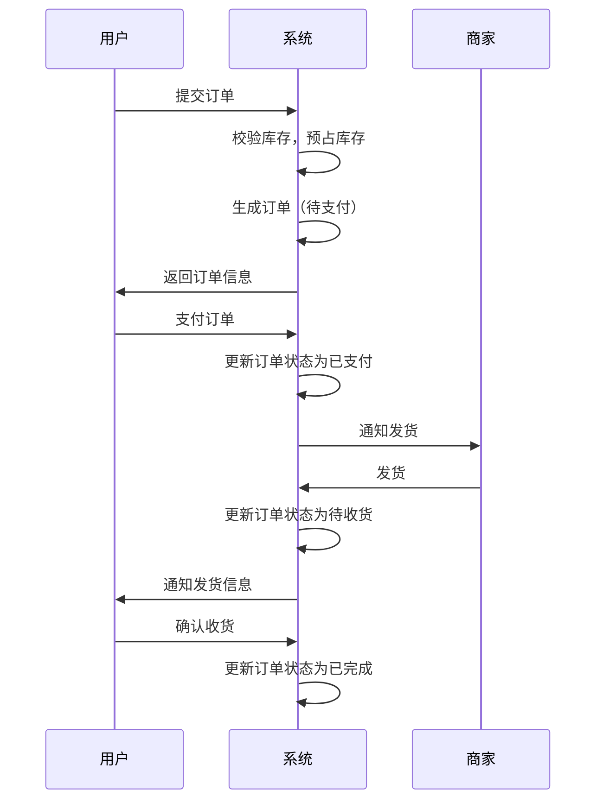

### 4.3 用例图

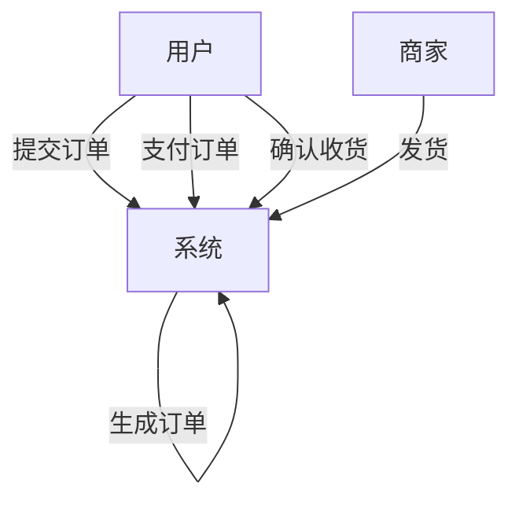

## 5. **支付流程**

### 5.1 流程步骤

1. 用户在订单页面选择支付方式（支付宝、微信、余额）。
2. 系统跳转至相应的支付平台，用户完成支付。
3. 支付平台异步通知系统支付结果。
4. 系统更新订单支付状态，记录交易信息。
5. 用户可在订单详情中查看支付状态。

### 5.2 业务流程图（泳道图）

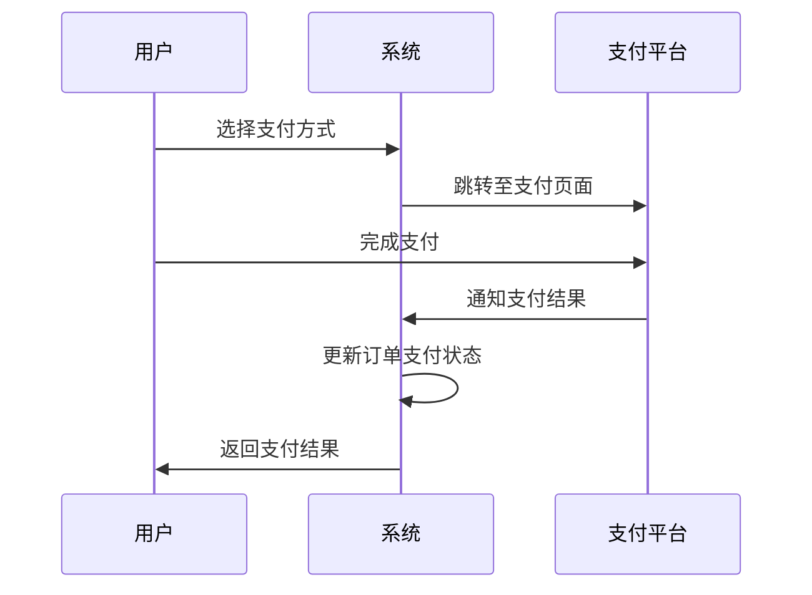

### 5.3 用例图

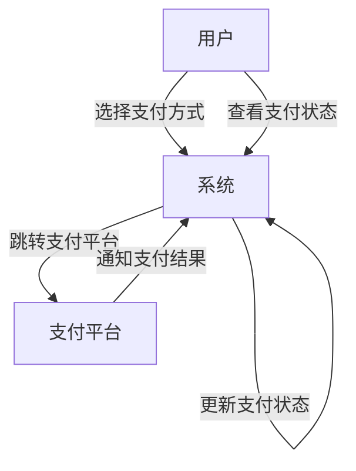

## 6. **库存处理流程**

### 6.1 流程步骤

1. 用户提交订单，系统预扣减库存。
2. 若用户支付成功，系统确认库存扣减。
3. 若用户支付失败或订单取消，系统回滚库存。
4. 系统使用分布式锁机制，确保库存操作的原子性。

### 6.2 业务流程图（泳道图）

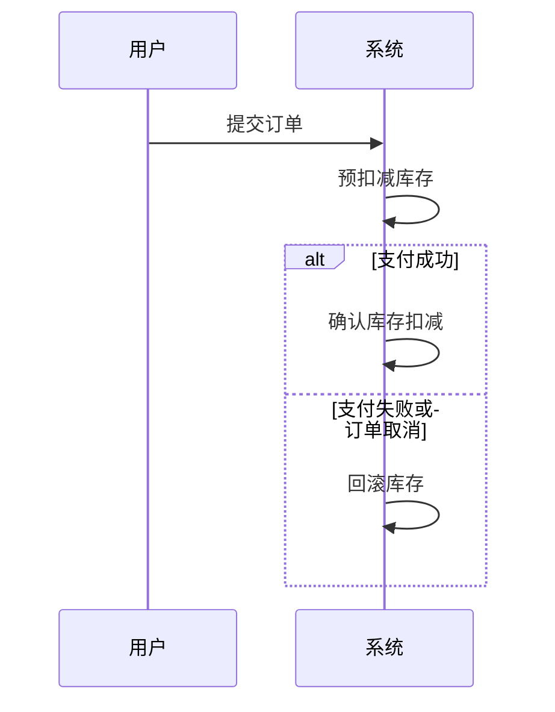

### 6.3 用例图

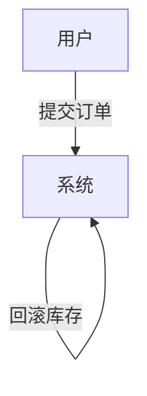

## 7. **发货与物流流程**

### 7.1 流程步骤

1. 商家在后台系统中查看已支付订单，准备发货。
2. 商家填写物流信息，提交发货。
3. 系统更新订单状态为“待收货”，并通知用户。
4. 用户可在订单详情中查看物流信息。
5. 用户收到商品后，确认收货，系统更新订单状态为“已完成”。

### 7.2 业务流程图（泳道图）

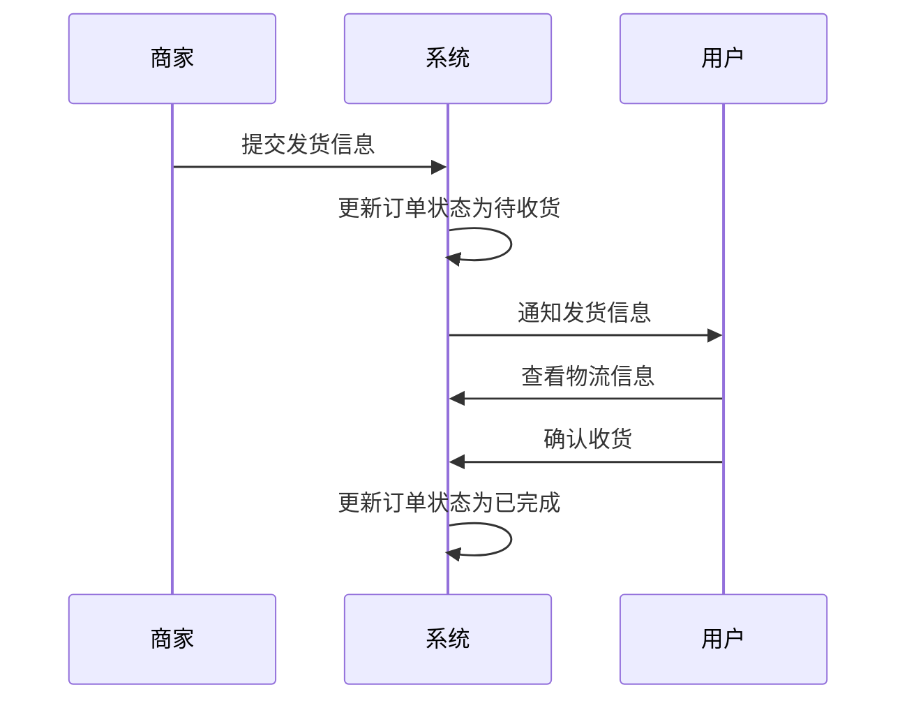

### 7.3 用例图

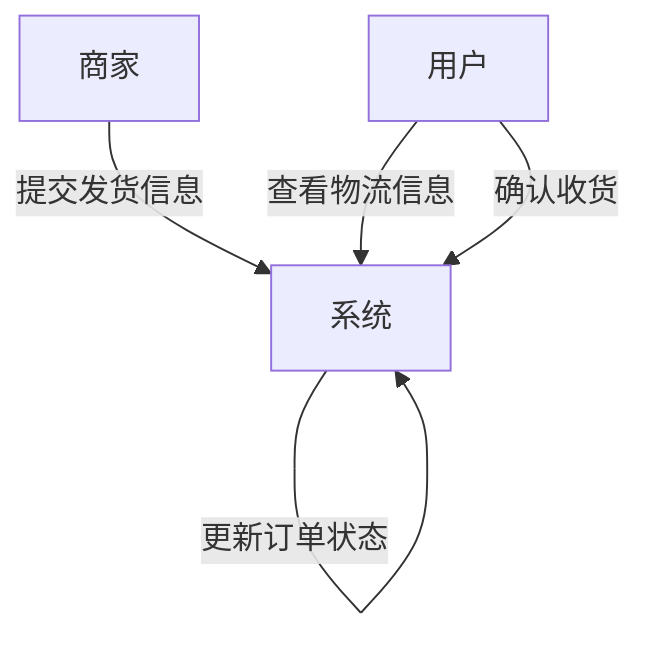

## 8. **评价与售后流程**

### 8.1 流程步骤

1. 用户在订单完成后，可对商品进行评价，填写星级和文字内容。
2. 用户在订单详情中点击“申请售后”，进入售后申请流程。
3. 用户选择售后类型（退款、退货退款、换货）、填写理由和上传凭证图片。
4. 系统记录申请，并通知商家。
5. 商家审核售后请求，选择“同意”或“拒绝”并填写原因。
6. 若同意，用户按流程退货或系统直接退款。
7. 售后完成后，系统记录售后结果并更新订单状态为“已售后”。

### 8.2 业务流程图（泳道图）

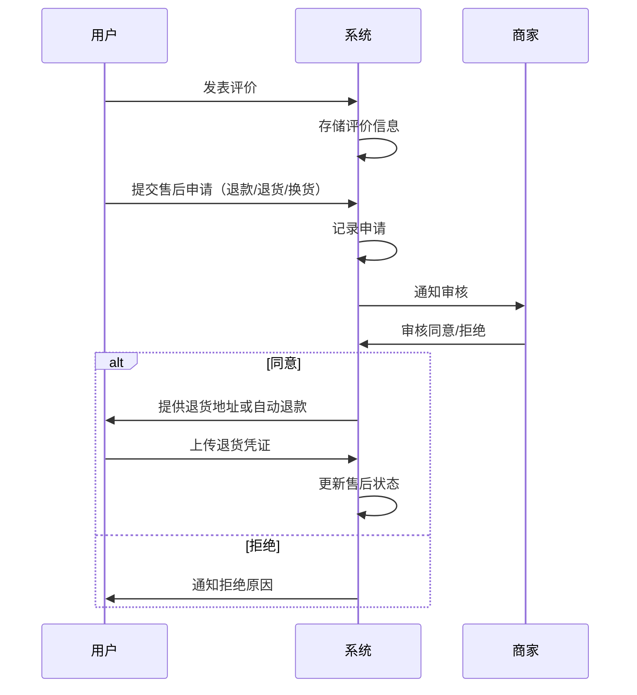

### 8.3 用例图

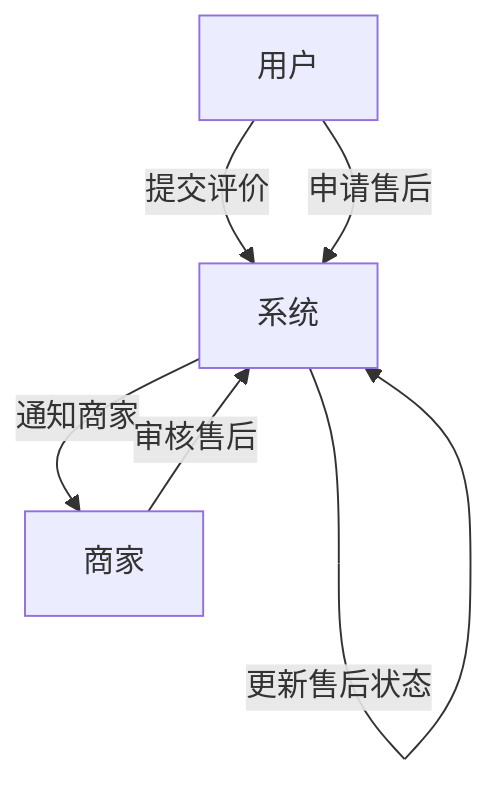